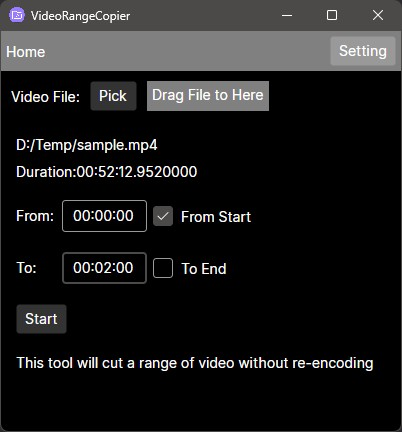

# VideoRangeCopier
A windows Avalonia v11 App which can cut a range of video into a new video without encoding.  
(Need ffmpeg installed and added into windows Environment variables)  

This project can be treat as a nice example for learning AvaloniaUI 11, which includes following features:  
* Basic route based on View Locator
* File picker
* File Drag and Drop
* MessageBox for Avalonia
* Publish almost as a single `.exe` file on windows
* Custom icon for published `.exe` file on windows

Basicly, this project is for tutorial. But also can be used as a handy video tool.   

  

(The Setting page is not used, it is just an example for router).

# How to use
* Download ffmpeg
* Setup windows Environment variables, so ffmpeg can be used anywhere.
* Download latest release of this project, unzip  

Then:  
* Run `VideoRangeCopier.Desktop.exe` to open GUI
* Pick a video file and set range
* Click Start button

Output video file will be in the same folder as input video and named as: `input_video_name(range_frame-range_to).ext`. `.ext` can be any video format ffmpeg support.  

