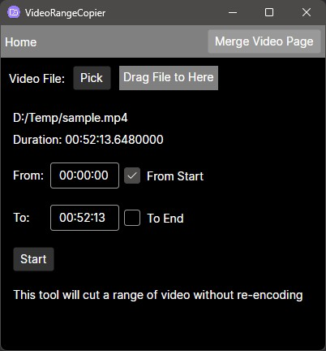
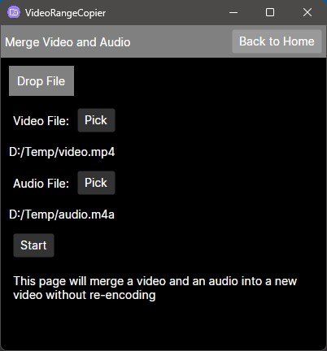

# VideoRangeCopier
A windows Avalonia v11 App which can:
* Cut a range of video into a new video without encoding.  
* Merge a video and an audio into a new video without encoding.  
(Both need ffmpeg installed and added into windows Environment variables)  

This project can be treated as a nice example for learning AvaloniaUI 11, which includes following features:  
* Route based on View Locator
* File picker
* File Drag and Drop
* MessageBox for Avalonia
* Helper method to handle debug log. 
* Publish as a single `.exe` file (almost) on windows
* Custom icon for published `.exe` file on windows

Basicly, this project is for tutorial. But also can be used as a handy video tool.   

     

(The Setting page is not used, it is just an example for router).

# How to use
* Download ffmpeg
* Setup windows Environment variables, so ffmpeg can be used anywhere.
* Download latest release of this project, unzip  
* Run `VideoRangeCopier.Desktop.exe`

Output video file will be in the same folder as input video.  

